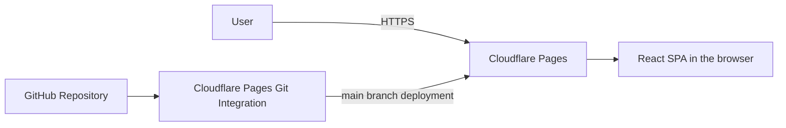

# flash-ansum

## About

flash-ansum (pronounced "flash-anzan") is a coined name combining **anzan** (mental arithmetic in Japanese) and **sum**.

> Practice mental arithmetic with numbers flashed one at a time.

A small, client-side web app with a chalkboard-inspired interface. The following describes the planned app.

## Features

- Addition and subtraction practice with numbers flashed one at a time.
- Adjustable difficulty: maximum digits, number count, and display interval.
- Answer submission followed by grading and the correct answer.
- New problems with the same settings for repeated practice.
- A chalkboard-inspired interface focused on readable numbers.

Mixed addition/subtraction, history, rankings, login, online multiplayer, backend APIs, databases, and PWA support are outside the current scope.

## Architecture

The app is a fully client-side React SPA hosted on Cloudflare Pages, with no backend, database, or authentication. Screens use React state transitions without React Router.



Cloudflare Pages will connect to the GitHub repository and deploy `main` to production. The domain is already managed by Cloudflare. GitHub Actions handles quality checks; Cloudflare Pages handles deployment.

## Design Principles

Game logic uses pure functions separate from React components. Side effects such as timers and randomness are kept at the edges to make the logic easy to test.

## Development

Install [mise and activate it in your shell](https://mise.jdx.dev/getting-started.html) before setting up the project. Node.js is pinned in `mise.toml`; npm is bundled with that Node.js version.

### First-time setup

Run these commands from the repository root:

```sh
mise trust
mise install
node --version
npm ci
```

Confirm that `node --version` matches the version in `mise.toml`. `npm ci` installs the dependencies recorded in `package-lock.json`.

### Local development

```sh
npm run dev
```

Open the local URL printed by Vite.

### Checks and formatting

```sh
npm run lint
npm test
npm run build
```

Use `npm run format` to format files, and `npm run test:watch` to run tests in watch mode. The lint command checks formatting, import ordering, and lint rules without modifying files.

The production build is written to `dist/`. Use `npm run preview` after building to preview it locally.

## CI

The GitHub Actions workflow, **PR Checks**, runs lint, tests, and a production build on pull requests targeting `main`. CI uses the same Node.js version as `mise.toml` and installs dependencies with `npm ci`. When updating Node.js, update both `mise.toml` and `.github/workflows/pr-checks.yml`. Deployment is handled by Cloudflare Pages Git integration.

## Tech Stack

| Purpose | Tools |
| --- | --- |
| App | Vite, React, TypeScript |
| Lint and formatting | Biome |
| Testing | Vitest, React Testing Library |
| CI | GitHub Actions |
| Hosting | Cloudflare Pages |
