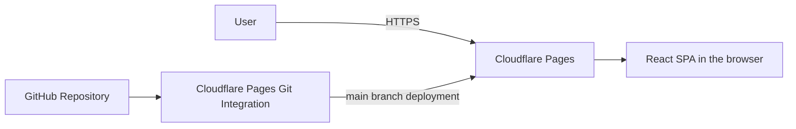

# flash-ansum

## About

flash-ansum (pronounced "flash-anzan") is a coined name combining **anzan** (mental arithmetic in Japanese) and **sum**.

> Practice mental arithmetic with numbers flashed one at a time.

A small, client-side web app with a chalkboard-inspired interface. The following describes the planned app.

## Features

- Addition and subtraction practice with numbers flashed one at a time.
- Adjustable difficulty: maximum digits, number count, and display interval.
- Answer submission followed by grading and the correct answer.
- New problems with the same settings for repeated practice.
- A chalkboard-inspired interface focused on readable numbers.

Mixed addition/subtraction, history, rankings, login, online multiplayer, backend APIs, databases, and PWA support are outside the current scope.

## Architecture

The app is a fully client-side React SPA hosted on Cloudflare Pages, with no backend, database, or authentication. Screens use React state transitions without React Router.

Cloudflare Pages will connect to the GitHub repository and deploy `main` to production. The domain is already managed by Cloudflare. GitHub Actions handles quality checks; Cloudflare Pages handles deployment.

## Design Principles

Game logic uses pure functions separate from React components. Side effects such as timers and randomness are kept at the edges to make the logic easy to test.

## CI

The GitHub Actions workflow, **PR Checks**, currently prints Hello World on pull requests, with lint, test, and build planned. Deployment is handled by Cloudflare Pages Git integration.

## Tech Stack

| Purpose | Tools |
| --- | --- |
| App | Vite, React, TypeScript |
| Lint and formatting | Biome |
| Testing | Vitest, React Testing Library |
| CI | GitHub Actions |
| Hosting | Cloudflare Pages |
